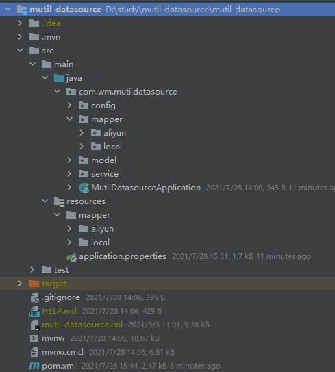
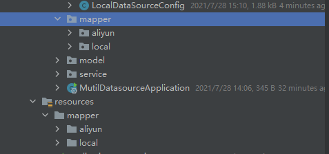

# 多数据源-笔记

基于SpringBoot+mybatis+Mysql的多数据源实例，数据库源为阿里云远程数据库和本地数据库。主要通过给不同的Mapper指定不同的数据源来实现在代码运行过程中数据源的控制。

项目结构



## 1、引入依赖包

```xml
		<dependency>
            <groupId>org.springframework.boot</groupId>
            <artifactId>spring-boot-starter-web</artifactId>
        </dependency>
        <dependency>
            <groupId>com.alibaba</groupId>
            <artifactId>druid-spring-boot-starter</artifactId>
            <version>1.1.10</version>
        </dependency>
        <dependency>
            <groupId>mysql</groupId>
            <artifactId>mysql-connector-java</artifactId>
        </dependency>
        <dependency>
            <groupId>org.mybatis.spring.boot</groupId>
            <artifactId>mybatis-spring-boot-starter</artifactId>
            <version>2.1.4</version>
        </dependency>

        <dependency>
            <groupId>org.projectlombok</groupId>
            <artifactId>lombok</artifactId>
            <optional>true</optional>
        </dependency>
        <dependency>
            <groupId>org.springframework.boot</groupId>
            <artifactId>spring-boot-starter-test</artifactId>
            <scope>test</scope>
        </dependency>
```

## 2、 properties中配置数据源

配置三个数据源，第一个为阿里云远程MySQL数据库配置，第二个默认的MySQL数据库配置，第三个为本地的MySQL数据库配置

```properties
spring.datasource.aliyun.driverClassName=com.mysql.cj.jdbc.Driver
spring.datasource.aliyun.jdbc-url=jdbc:mysql://47.110.71.90:3306/test?useSSL=false&useUnicode=true&characterEncoding=UTF-8&serverTimezone=UTC
spring.datasource.aliyun.username=root
spring.datasource.aliyun.password=root

spring.datasource.username=root
spring.datasource.password=root
spring.datasource.url=jdbc:mysql://47.110.71.90:3306/test
spring.datasource.driver-class-name=com.mysql.cj.jdbc.Driver

spring.datasource.local.driverClassName=com.mysql.cj.jdbc.Driver
spring.datasource.local.jdbc-url=jdbc:mysql://localhost:3306/test?useSSL=false&useUnicode=true&characterEncoding=UTF-8&serverTimezone=UTC
spring.datasource.local.username=root
spring.datasource.local.password=123456
```

## 3、给数据源添加配置类

本地数据源配置类

在该配置类中通过过@MapperScan先指定需要扫描的Mapper类以及指定sqlSessionFactory，

配置localDataSource数据源，以及localSqlSessionFactory，并将localSqlSessionFactory和localDataSource绑定

```java
package com.wm.mutildatasource.config;

import org.apache.ibatis.session.SqlSessionFactory;
import org.mybatis.spring.SqlSessionFactoryBean;
import org.mybatis.spring.SqlSessionTemplate;
import org.mybatis.spring.annotation.MapperScan;
import org.springframework.beans.factory.annotation.Qualifier;
import org.springframework.boot.context.properties.ConfigurationProperties;
import org.springframework.boot.jdbc.DataSourceBuilder;
import org.springframework.context.annotation.Bean;
import org.springframework.context.annotation.Configuration;
import org.springframework.context.annotation.Primary;
import org.springframework.core.io.support.PathMatchingResourcePatternResolver;

import javax.sql.DataSource;

/**
 * @author: wangm
 * @date: 2021/7/28 14:07
 * @Description
 */
@Configuration
@MapperScan(basePackages = "com.wm.mutildatasource.mapper.local", sqlSessionFactoryRef = "localSqlSessionFactory")
public class LocalDataSourceConfig {

    @Bean(name = "localDataSource")
    @Primary
    @ConfigurationProperties("spring.datasource.local")
    public DataSource dataSource(){
        return DataSourceBuilder.create().build();
    }


    @Bean(name = "localSqlSessionFactory")
    public SqlSessionFactory sqlSessionFactory(@Qualifier("localDataSource") DataSource dataSource)
            throws Exception {
        SqlSessionFactoryBean bean = new SqlSessionFactoryBean();
        bean.setDataSource(dataSource);
        bean.setMapperLocations(
                new PathMatchingResourcePatternResolver()
                        .getResources("classpath*:mapper/local/*.xml")
        );
        return bean.getObject();
    }

    public SqlSessionTemplate sqlSessionTemplate(@Qualifier("localSqlSessionFactory") SqlSessionFactory sqlSessionFactory){
        return new SqlSessionTemplate(sqlSessionFactory);
    }
}
```

阿里云数据源配置类

在该配置类中通过过@MapperScan先指定需要扫描的Mapper类以及指定sqlSessionFactory，

配置aliyunDataSource数据源，以及aliyunSqlSessionFactory，并将aliyunSqlSessionFactory和aliyunDataSource绑定

```java
package com.wm.mutildatasource.config;

import org.apache.ibatis.session.SqlSessionFactory;
import org.mybatis.spring.SqlSessionFactoryBean;
import org.mybatis.spring.SqlSessionTemplate;
import org.mybatis.spring.annotation.MapperScan;
import org.springframework.beans.factory.annotation.Qualifier;
import org.springframework.boot.context.properties.ConfigurationProperties;
import org.springframework.boot.jdbc.DataSourceBuilder;
import org.springframework.context.annotation.Bean;
import org.springframework.context.annotation.Configuration;
import org.springframework.context.annotation.Primary;
import org.springframework.core.io.support.PathMatchingResourcePatternResolver;

import javax.sql.DataSource;

/**
 * @author: wangm
 * @date: 2021/7/28 14:07
 * @Description
 */
@Configuration
@MapperScan(basePackages = "com.wm.mutildatasource.mapper.aliyun",sqlSessionFactoryRef = "aliyunSqlSessionFactory")
public class AliyunDataSourceConfig {

    @Bean(name = "aliyunDataSource")
    @Primary
    @ConfigurationProperties("spring.datasource.aliyun")
    public DataSource dataSource(){
        return DataSourceBuilder.create().build();
    }


    @Bean(name = "aliyunSqlSessionFactory")
    public SqlSessionFactory sqlSessionFactory(@Qualifier("aliyunDataSource") DataSource dataSource)
            throws Exception {
        SqlSessionFactoryBean bean = new SqlSessionFactoryBean();
        bean.setDataSource(dataSource);
        bean.setMapperLocations(
                new PathMatchingResourcePatternResolver()
                        .getResources("classpath*:mapper/aliyun/*.xml")
        );
        return bean.getObject();
    }

    public SqlSessionTemplate sqlSessionTemplate( @Qualifier("aliyunSqlSessionFactory") SqlSessionFactory sqlSessionFactory){
        return new SqlSessionTemplate(sqlSessionFactory);
    }
}
```

## 4、定义调用不同数据源的Mapper

根据第三步创建Mapper类和sql。



## 5、调用

创建完成Mapper之后可通过Service层进行调用